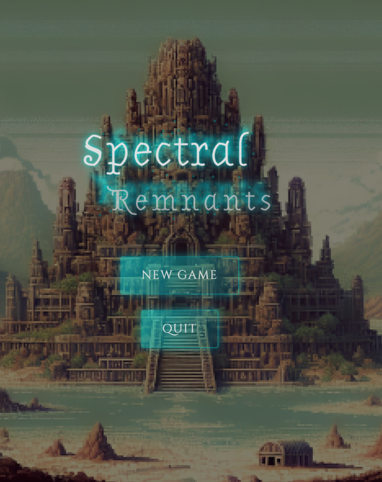
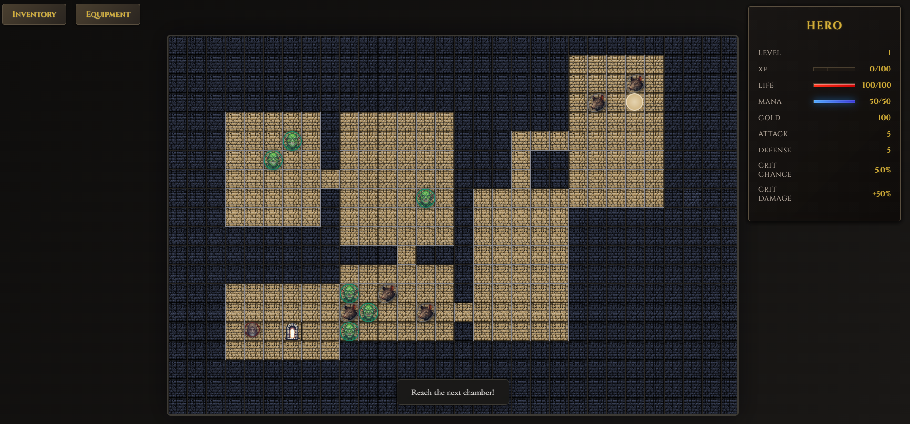
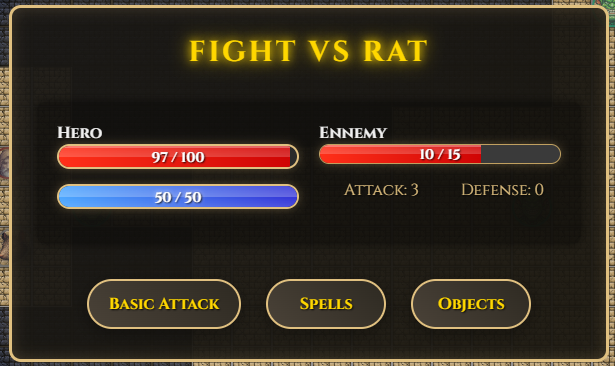
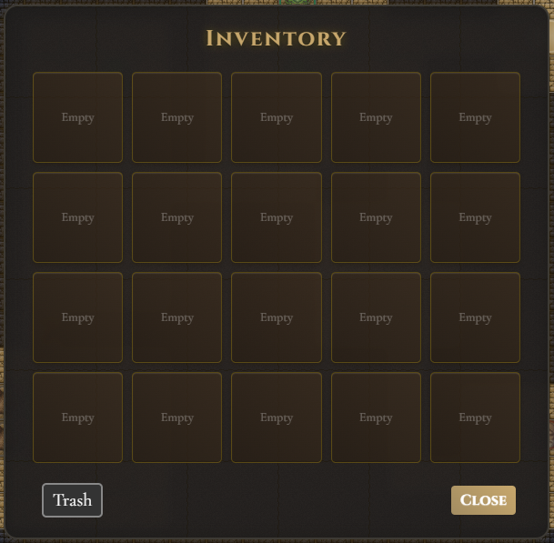
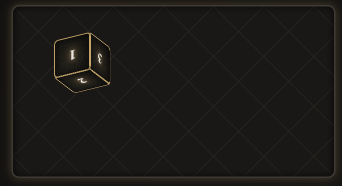

# Spectral Remnants

**Status:** Proof of Concept – In Development  
**Technologies:** HTML5, CSS3, JavaScript (ES6)

## Introduction



**Spectral Remnants**  is a technical proof of concept for a dungeon-crawling game developed in HTML5, CSS3, and JavaScript (ES6). This project explores advanced gameplay mechanics, such as procedural dungeon generation, turn-based combat, dynamic inventory management, and modular game architecture.

I chose to build a dungeon crawler because I’ve always enjoyed rogue-like games, especially the original Rogue. This genre provides an excellent playground to experiment with a variety of game mechanics like procedural generation, RPG elements, and strategic turn-based combat. I wanted to create a project that challenged me to implement these systems from scratch.

Throughout this project, I’ve learned a lot by building everything from the ground up—menus, interactions between inventory items, handling dynamic UI elements, and managing game states. This has been a valuable experience in understanding game architecture and the importance of clean, modular code.

**Note:** This project is a development playground, not a finished game, allowing for experimentation with game mechanics and modular systems that other developers can easily extend.

## Project Goals

### 1. Technical Demonstration
The goal of this project is to showcase key systems involved in dungeon crawler development:

- **Procedural Dungeon Generation:** Using the Binary Space Partitioning (BSP) algorithm to create random, unique dungeons.
- **Turn-Based Combat:** Combat mechanics driven by stats like attack, defense, critical hit chance, buffs, and dynamic damage calculation.
- **Dynamic Inventory System:** Players can collect and manage items like weapons, potions, and armor, which affect hero stats.

### 2. Modular Architecture
All features—dungeon generation, combat, rendering, inventory management—are decoupled into independent modules. This ensures that each module can be extended or replaced without affecting the rest of the game, supporting future expansions and easier maintenance.

## Key Features

### 1. Procedural Dungeon Generation
Spectral Remnants employs the **BSP algorithm** to split the dungeon into rooms and corridors, ensuring unique layouts every time the player enters a new level.




#### Process:
- **Room Creation:** BSP divides the map into sections where rooms are randomly placed.
- **Corridor Generation:** Corridors connect the rooms in a logical flow.
- **Random Placement of Enemies and Items:** Items and enemies are placed based on the player's level and dungeon difficulty.

#### Example from `dungeon.js`:
```
generateRooms() {
    const numRooms = Math.floor(Math.random() * 3) + 4;
    for (let i = 0; i < numRooms; i++) {
        let room;
        let attempts = 0;
        const maxAttempts = 100;
        do {
            room = this.createRoom();
            attempts++;
        } while (this.doesRoomOverlap(room) && attempts < maxAttempts);
        if (attempts < maxAttempts) {
            this.carveRoom(room);
            this.rooms.push(room);
        }
    }
}
```

#### Extending Dungeon Generation:
The dungeon generation system can easily be extended with new room types (e.g., treasure rooms, trap-filled chambers) or features like destructible terrain.

### 2. Turn-Based Combat System
Combat is calculated based on hero and enemy stats, including factors like attack, defense, and critical hit chances. The system is modular and customizable.




#### Process:
- **Damage Calculation:** Damage is determined by subtracting the defender's defense from the attacker's attack power.
- **Critical Hits:** Based on a percentage chance, with a damage multiplier applied on success.
- **Buffs and Debuffs:** Temporary effects that modify stats during combat.

#### Example from `combat.js`:
```
calculateDamage(attacker, defender) {
    const baseDamage = attacker.stats.attack - defender.stats.defense;
    const damage = baseDamage > 0 ? baseDamage : 1;
    
    if (this.isCriticalHit(attacker)) {
        return Math.floor(damage * attacker.stats.critMultiplier);
    }
    return damage;
}
```

#### Extending Combat Mechanics:
Add elemental damage types or advanced enemy AI, such as enemies that react dynamically to player actions or flee when health is low.

### 3. Dynamic Inventory System
Players manage their inventory, collecting items that influence their stats. The system is flexible and supports adding new items or mechanics like crafting.




#### Process:
- **Inventory Slots:** Limited by available slots; items must be swapped if the inventory is full.
- **Item Effects:** Weapons increase attack, potions restore health, etc.

#### Example from `hero.js`:
```
addItemToInventory(itemKey) {
    if (!ITEMS[itemKey]) {
        console.error(`Item with key ${itemKey} does not exist.`);
        return;
    }

    const item = ITEMS[itemKey];
    if (!this.hasInventorySpace()) {
        this.handleFullInventory(itemKey);
        return;
    }

    if (this.inventory[itemKey]) {
        this.inventory[itemKey].quantity++;
    } else {
        this.inventory[itemKey] = { key: itemKey, quantity: 1 };
    }
}
```

#### Extending Inventory Management:
Future expansions could include crafting or item durability, adding more strategic depth to inventory management.


### 4.IA and Random Events




The AI system is still basic and allows enemies to act according to simple patterns during combat, but future improvements are planned. Random events, such as interactions with statues or hidden rooms, add an element of unpredictability.

#### Example from `randomEvents.js`:
```
interactWithStatue(hero, dungeon, game, x, y) {
    const modal = document.createElement('div');
    this.setupModal(modal, "In Front of the Warrior Statue.");
    modal.innerHTML = `
        <h2>In Front of the Warrior Statue.</h2>
        <p>You stand before an imposing statue of an ancient warrior...</p>
        <button id="continue">Continue</button>
    `;
    modal.querySelector('#continue').addEventListener('click', () => {
        document.body.removeChild(modal);
        this.showStatueInteractionChoices(hero, dungeon, game);
    });
    document.body.appendChild(modal);
}
```
### 5. Modular Game Architecture
Each system is decoupled, allowing easy modifications without impacting other parts of the game.

#### Examples:
- **Dungeon Generation:** Can be extended with new room types or traps without affecting combat or inventory.
- **AI:** Add new enemy types or behaviors without modifying the dungeon or rendering modules.
- **Spells:** Easily add new spells in `spells.js` without touching the combat engine.

## License

This project is licensed under the **MIT License**. You are free to use, modify, and share the code, as long as you give credit to [Pixel Perfekt](https://pixelperfekt.me/).

See the LICENSE file for more details.

## Contributions

Contributions are more than welcome! Whether you’re a game developer, a fan of rogue-likes, or simply someone who loves tinkering with code, I’d love to see what you bring to **Spectral Remnants**. 💡 

Here are some ideas for how you could contribute:

- **Improving Combat Mechanics:** Add new enemies, buffs, debuffs, or tweak the battle systems to create even more exciting gameplay.
- **Extending Dungeon Generation:** Design new room types, tricky traps, or hidden areas to make each run even more unique.
- **Expanding Inventory Features:** Build out crafting systems, add item durability, or introduce rare, powerful artifacts.
- **Enhancing AI Behavior:** Implement smarter enemies or random events that challenge the player in new ways.

Feel free to submit issues, pull requests, or just drop a message. Let’s collaborate and make something awesome together! ✨

Thank you for checking out **Spectral Remnants**—I hope you have as much fun exploring it as I had creating it! 💜

— Made with ❤️ by [Pixel Perfekt](https://pixelperfekt.me/)

